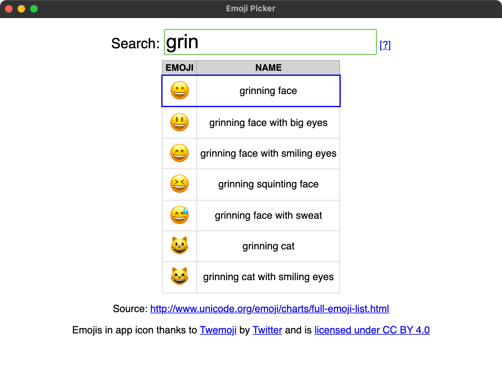

# Emoji Picker

- An emoji picker that focuses on search and keyboard use
   - Type to search
   - Use cursor arrow keys to move up and down
   - Press "Enter" to copy to clipboard

- Configurable global shortcut
   - Record the shortcut or manually type it out

- System Tray icon

## Acknowledgments

- Source of emoji data: http://www.unicode.org/emoji/charts/full-emoji-list.html

- Emojis in app icon thanks to [Twemoji](https://github.com/twitter/twemoji/) by [Twitter](https://twitter.com) and is [licensed under CC BY 4.0](https://creativecommons.org/licenses/by/4.0/)
